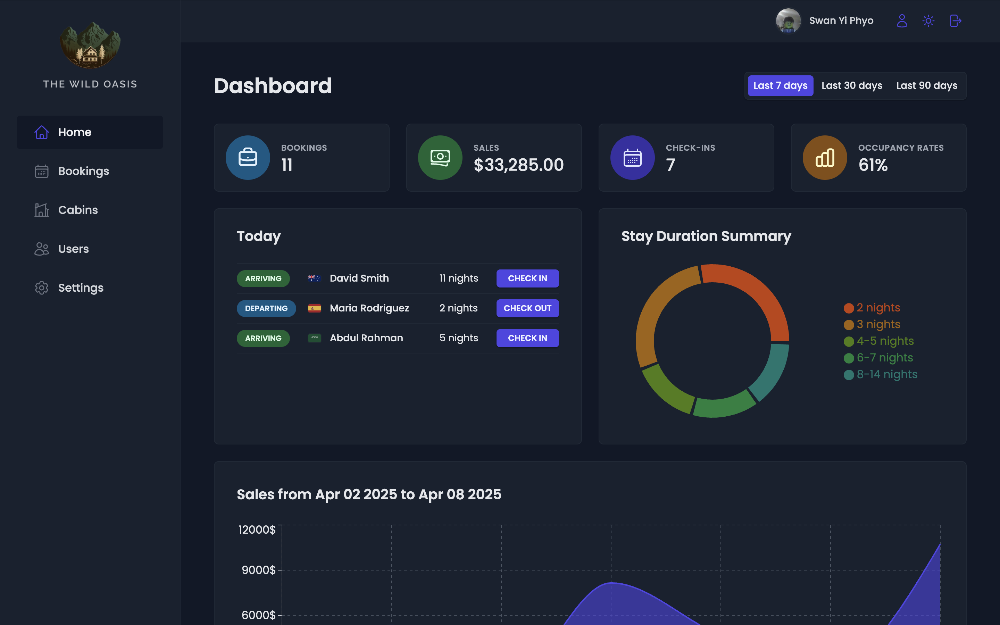

# The Wild Oasis – Hotel Management Dashboard

<p align="center">
  
</p>

**The Wild Oasis** is a secure hotel management dashboard built for internal use by hotel staff. It enables employees to manage guest bookings, check-ins and check-outs, cabin inventory, user accounts, and general hotel settings. The dashboard also provides real-time business insights through interactive charts and a clean, responsive interface.



## Table of Contents

- [Features](#features)
- [Tech Stack](#tech-stack)
- [Getting Started](#getting-started)
  - [Prerequisites](#prerequisites)
  - [Installation](#installation)
- [🌐 Live Demo](#-live-demo)
- [License](#license)
- [Contact](#contact)

## Features

- **Secure Login System**
  - Email/password authentication via Supabase.
  - Email confirmation required before login.
  - Route protection: only authenticated users can access the dashboard.

- **Dashboard Overview**
  - View key metrics: Total Sales, Bookings, Check-ins, Occupancy Rate.
  - Today’s activity overview: arriving and departing guests.
  - Visual insights with:
    - Pie Chart (Stays Summary)
    - Area Chart (Sales and Extras – e.g., Breakfast)
  - Time filter options: last 7, 30, and 90 days.

- **Bookings Management**
  - View all bookings with cabin name, guest info, date range, and status.
  - Booking statuses: `Unconfirmed`, `Checked-in`, `Checked-out`.
  - Booking actions:
    - Check in / add breakfast (if not included initially).
    - Check out (when status is checked-in).
    - Delete (available at any status).
  - Filters by status and sorts by date/price.
  - URL search params persist filters and sorting.
  - Pagination with **React Query prefetching** for smoother user experience during navigation.

- **Cabin Management**
  - Full CRUD for cabin listings.
  - Filter by discount status.
  - Sort by name, price, capacity (asc/desc).

- **User Management**
  - Admins can create new user accounts.
  - Users can update:
    - Profile picture
    - Name
    - Password

- **Settings Management**
  - General hotel rules:
    - Breakfast price
    - Min/Max nights per booking
    - Max guests per booking

- **Theme Support**
  - Light/Dark mode toggle for better user experience.

## Tech Stack

### Frontend
- **React**
- **React Router** (with route guarding)
- **React Query** (remote state handling, with pagination prefetching)
- **React Hook Form + Zod** (form validation)
- **Styled Components** (styling)
- **Recharts** (data visualization)
- **React Hot Toast** (notifications)
- **Date-fns** (date formatting)
- **Error Boundary**

### Backend / Database
- **Supabase**
  - Auth (Email/password + email confirmation)
  - Database with RLS enabled for secure access
  - Storage (for profile picture uploads)
  - Tables:
    - `bookings` (FK: `cabinId`, `guestId`)
    - `cabins`
    - `guests`
    - `settings`

## Getting Started

### Prerequisites
- Supabase project (with tables and RLS policies configured)

### Installation

```bash
# Clone the repo
git clone https://github.com/fisheeesh/the-wild-oasis.git
cd the-wild-oasis

# Install dependencies
npm install

# Start the development server
npm run dev
```

## 🌐 Live Demo
Check out the live version of The Wild Oasis Dashboard: 

## License
This project is licensed under the [MIT License](LICENSE).

---
Built with care by **Fisheeesh**

📧 Contact: [swanphyo444@gmail.com](mailto:swanphyo444@gmail.com)
